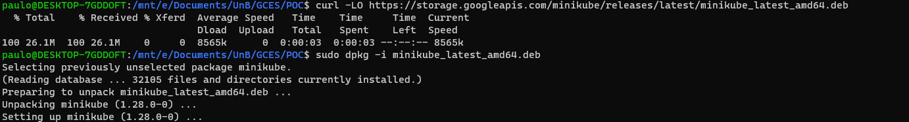
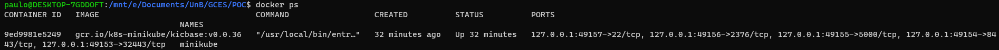
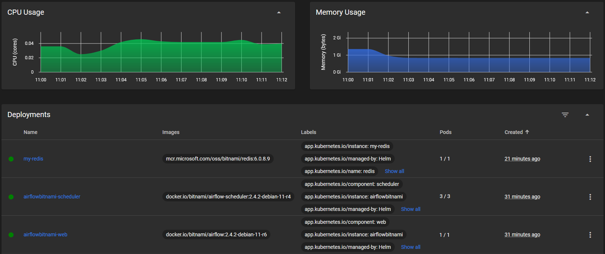

# Aprendizados em Kubernetes

## Introdução ao Kubernetes

O grupo teve contato com o [Marco Nery](https://github.com/MarcosNBJ), meta coach do projeto na disciplina, que fez uma apresentação geral do [Kubernetes](https://github.com/kubernetes/), juntamente com qual é a forma de comunicação utilizada pelo [Kubernetes](https://github.com/kubernetes/) e alguns tutoriais de GO e [Kubernetes](https://github.com/kubernetes/).

### Tutoriais

#### GO

1. [Introdução - Aprenda Go com Testes (gitbook.io)](https://larien.gitbook.io/aprenda-go-com-testes/)
2. [Aprenda Go](https://www.youtube.com/playlist?list=PLCKpcjBB_VlBsxJ9IseNxFllf-UFEXOdg)

#### Kubernetes

1. [Introduction to Kubernetes](https://training.linuxfoundation.org/training/introduction-to-kubernetes/)
   1. Curso mais profundo sobre o kubernetes.
2. [Aprenda as noções básicas do Kubernetes | Kubernetes](https://kubernetes.io/pt-br/docs/tutorials/kubernetes-basics/)
   1. Curso com apenas o basico de kubernetes.

## Teste Kubernetes

Para que pudessemos testar o [Kubernetes](https://github.com/kubernetes/), decidimos utilizar o [minikube](https://github.com/kubernetes/minikube) que é uma forma de implementar o [Kubernetes](https://github.com/kubernetes/) localmente.

### Instalação

Para começar temos que instalar o minikube, que dependendo da sua maquina os comandos podem variar.

Mas seguimos o [tutorial de instalação](https://minikube.sigs.k8s.io/docs/start/) disponibilizado pelo proprio [minikube](https://github.com/kubernetes/minikube).



Apos a instalação. Temos que iniciar o [minikube](https://github.com/kubernetes/minikube) com o comando:

```sh
minikube start
```

Com isso temos um cluster local do [Kubernetes](https://github.com/kubernetes/)



### Caso de teste

Para poder testar o [minikube](https://github.com/kubernetes/minikube), decidimos tentar colocar uma instancia do [Airflow](https://airflow.apache.org/) que é um software de agendamento e monitoramento para scripts, para rodar dentro do nosso cluster de kubernetes.

Para que isso seja possivel decidimos utilizar a ferramenta [Helm](https://helm.sh/) que é um gerenciador de pacotes para Kubernetes.

Seguindo o as [instruções de instalação providas pelo proprio airflow](https://airflow.apache.org/docs/helm-chart/stable/index.html), conseguimos instanciar um airflow.


